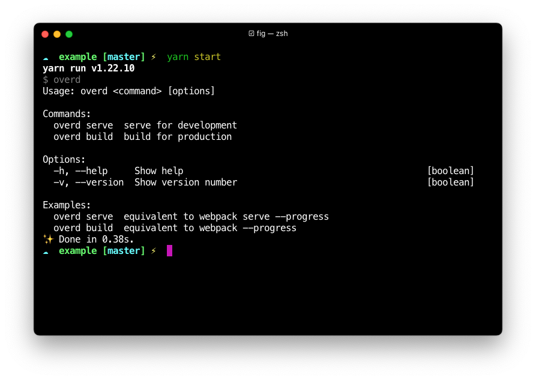

<h1 align="center">Overd</h1>

<p align="center">
  <a href="https://www.npmjs.com/package/overd"></a>
</p>



### Introduction

A configurable building tools based on webpack@5.

### Quick Start

```bash
# install overd it's self.
$ yarn add overd -D
```

```bash
# install all devDependencies that overd needs
$ yarn add \
    @intervolga/optimize-cssnano-plugin@1.0.6 \
    @pmmmwh/react-refresh-webpack-plugin@0.4.3 \
    @types/copy-webpack-plugin@8.0.0 \
    @types/css-minimizer-webpack-plugin@3.0.1 \
    @types/dotenv-webpack@7.0.2 \
    @types/duplicate-package-checker-webpack-plugin@2.1.1 \
    @types/mini-css-extract-plugin@1.4.3 \
    @types/node@15.12.2 \
    @types/react-dev-utils@9.0.6 \
    @types/script-ext-html-webpack-plugin@2.1.2 \
    @types/terser-webpack-plugin@5.0.3 \
    @types/webpack@5.28.0 \
    @types/webpack-bundle-analyzer@4.4.0 \
    @types/webpack-dev-server@3.11.4 \
    babel-loader@8.2.2 \
    chalk@4.1.1 \
    copy-webpack-plugin@9.0.0 \
    css-loader@5.2.6 \
    css-minimizer-webpack-plugin@3.0.1 \
    dotenv-webpack@7.0.3 \
    duplicate-package-checker-webpack-plugin@3.0.0 \
    html-webpack-plugin@5.3.1 \
    mini-css-extract-plugin@1.6.0 \
    nodemon@2.0.7 \
    react-dev-utils@11.0.4 \
    react-refresh@0.10.0 \
    script-ext-html-webpack-plugin@2.1.5 \
    style-loader@2.0.0 \
    terser-webpack-plugin@5.1.3 \
    thread-loader@3.0.4 \
    ts-node@10.0.0 \
    tsconfig-paths@3.9.0 \
    type-fest@1.2.0 \
    typescript@4.3.2 \
    webpack@5.38.1 \
    webpack-bundle-analyzer@4.4.2 \
    webpack-cli@4.7.2 \
    webpack-dev-server@3.11.2 \
    webpack-manifest-plugin@3.1.1 \
    webpack-merge@5.8.0 \
    workbox-webpack-plugin@6.1.5 -D
```

[Why should I need to install devDependencies myself ?](#why-should-i-need-to-install-devdependencies-myself)

### Why should I need to install devDependencies myself?

In today's pipeline, we are using so many code quality check tools including `checkmarx`, `sonar`, `whitesource`.
Those tools checks our dependencies constantly, and make our pipeline failed once there is one potential security vulnerabilities existed.
The problem is that building tools may not fix the security problem as soon as possible. There for, we are more willing to have user to install
all the devDependencies by themself instead of using `yarn resolutions` for the two purpose:

1. Avoiding duplicated package like typescript, user may install it already.
2. Make dependencies straightforward.

### What's the difference between create-react-app?

- Overd don't provide babel configuration
- Overd don't provide eslint configuration
- Revise webpack config easily without eject

### Features

| Feature              | Status |
| -------------------- | ------ |
| Persistent cache     | ✅     |
| React Refresh        | ✅     |
| Thread-loader        | ✅     |
| Less support         | ✅     |
| Configurable webpack | ✅     |
| Lazy compilation     | ✅     |
| Auto restart         | ✅     |
| Yarn pnp             | Todo   |

### FAQ

#### Override default config

Put a **webpack-overd.ts** under your project's space, then you revise the webpack config easily.

```ts
export default function (config: import('webpack').Configuration) {
  if (config.mode === 'development') {
    config.experiments = {
      lazyCompilation: false // disable lazyCompilation
    };
  }
  console.log(config);
}
```

### License

[MIT](https://opensource.org/licenses/MIT)

Copyright (c) 2021-present, Army-U
